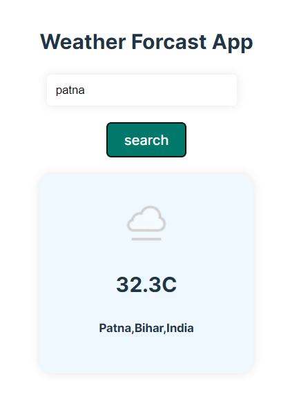

# React + Vite

# Weather Forecast App

## Overview
The Weather Forecast App is a simple web application that allows users to search for the current weather in any city. The app is built using React.js and leverages several hooks such as `useState`, `useEffect`, and `useContext` to manage state and side effects. It also uses the Context API to manage global state across the application. The weather data is fetched from a REST API.

## Features
- By default it will show the current Location weather Status
- Search for the current weather in any city.
- Display weather information including temperature, weather conditions, and location.
- Responsive design for use on both desktop and mobile devices.

## Technologies Used
- **React.js**: JavaScript library for building user interfaces.
- **React Hooks**: `useState`, `useEffect`, and `useContext` for state and side effect management.
- **Context API**: For managing global state.
- **REST API**: Fetch weather data from an external API.
- **CSS3**: For styling the application.

## Final UI of Project
   ## by default user interface
        
   ## After Enter city name
    


## diffrent Hooks and uses in this project

## useState Hook
Used to manage local state within components, such as the city input and weather data.

## useEffect Hook
Used to fetch weather data from the REST API when the component mounts or when the search term changes.

## useContext Hook
Used with the Context API to manage and provide global state across the application. The WeatherContext provides weather data and functions to update this data.

## Fetching Data
The useEffect hook in combination with a custom hook useFetchWeather is used to fetch weather data from the API and update the state.

## Global State Management
The Context API is used to manage global state. The WeatherContext provides weather data and update functions to components that need access to this state.

## Setup and Installation
1. **Clone the repository**:
   ```bash
   git clone https://github.com/yourusername/weather-forecast-app.git
   cd weather-forecast-app


This template provides a minimal setup to get React working in Vite with HMR and some ESLint rules.

Currently, two official plugins are available:

- [@vitejs/plugin-react](https://github.com/vitejs/vite-plugin-react/blob/main/packages/plugin-react/README.md) uses [Babel](https://babeljs.io/) for Fast Refresh
- [@vitejs/plugin-react-swc](https://github.com/vitejs/vite-plugin-react-swc) uses [SWC](https://swc.rs/) for Fast Refresh
